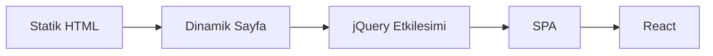
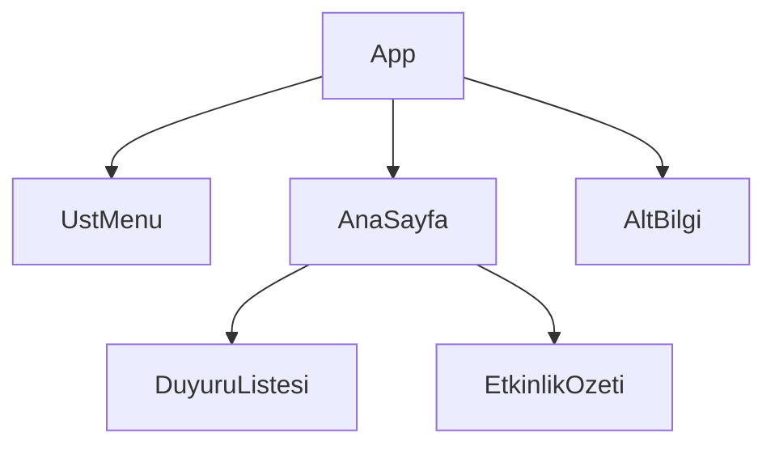
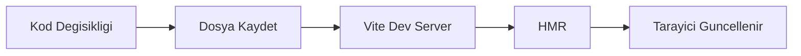
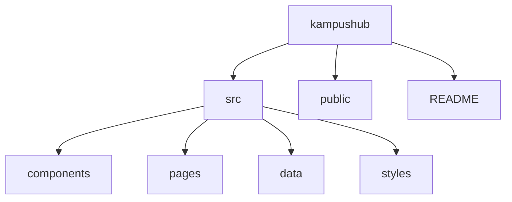

# Bölüm 1: Modern Web’e Giriş ve Geliştirme Ortamı

## 1.1 Bölümün yol haritası

Bir web sayfası yalnızca HTML ve CSS ile görüntülenebiliyorsa, neden React, Node.js, npm ve Vite gibi ek araçlara ihtiyaç duyarız? Bu bölümün ana motivasyon sorusu budur. React’e başlamadan önce, modern web uygulamalarının nasıl çalıştığını, geliştirme ortamının hangi araçlardan oluştuğunu ve dönem boyunca büyüteceğimiz KampüsHub projesinin nasıl başlatılacağını anlamamız gerekir.

Bu bölümde React’in tüm sözdizimini öğrenmeyeceğiz. JSX kuralları, props, state, hooks, router, API entegrasyonu ve test konuları sonraki bölümlerde adım adım ele alınacaktır. Bu bölümün görevi, öğrencinin bilgisayarında çalışır bir React geliştirme zemini kurmak ve KampüsHub için ilk proje iskeletini hazırlamaktır.

Bu bölümde şu sorulara yanıt arayacağız:

1. Modern web uygulamaları klasik statik HTML sayfalarından nasıl ayrılır?
2. SPA yaklaşımı nedir ve React bu yaklaşımda hangi rolü üstlenir?
3. React neden bileşen tabanlı bir mimari sunar?
4. Node.js, npm ve Vite geliştirme sürecinde hangi görevleri üstlenir?
5. Node.js ve npm sürümleri terminalden nasıl doğrulanır?
6. Vite ile ilk React projesi nasıl oluşturulur?
7. Vite klasör yapısındaki `index.html`, `src/main.jsx`, `src/App.jsx` ve `package.json` dosyaları ne işe yarar?
8. `npm run dev`, `npm run build` ve `npm run preview` komutları hangi amaçlarla kullanılır?
9. HMR, geliştirme sürecini nasıl hızlandırır?
10. KampüsHub projesinin başlangıç klasör yapısı nasıl kurulmalıdır?

> **🎯 Bölüm Hedefi:** Bu bölümün sonunda öğrenci, React geliştirme ortamını kurabilecek, Vite ile ilk React projesini oluşturabilecek, temel proje dosyalarının rolünü açıklayabilecek ve KampüsHub projesi için düzenli bir başlangıç iskeleti hazırlayabilecektir.

> **⚠️ Dikkat:** Bu bölüm bir React sözdizimi bölümü değildir. Amaç; React kodlarını yazmaya başlamadan önce araç zincirini, proje klasörlerini, terminal komutlarını ve çalışma döngüsünü sağlamlaştırmaktır.

[SCREENSHOT:b01_01_vite_ilk_ekran]

## 1.2 Bölümün konumu ve pedagojik rolü

Bu bölüm, kitabın başlangıç bölümüdür ve Kısım 0 — Temeller: JavaScript ve Modern Web başlığı altında yer alır. Okuyucunun HTML ve CSS bildiği, ancak modern JavaScript, Node.js, npm, Vite ve React ekosistemini henüz sistematik biçimde kullanmadığı varsayılır.

Klasik bir HTML/CSS çalışmasında dosyayı tarayıcıda açmak çoğu zaman yeterlidir. React uygulamasında ise kaynak dosyalar genellikle doğrudan tarayıcıya verilmez; geliştirme sunucusu, modül sistemi, bağımlılık yönetimi ve üretim derlemesi gibi ek adımlar devreye girer. Bu nedenle React öğrenmeye başlamadan önce araç zincirini anlamak, sonraki bölümlerde karşılaşılacak hataların büyük kısmını önler.

Bölüm 2’de modern JavaScript ES6+ kavramlarına geçeceğiz. `let`, `const`, template literal, destructuring, arrow function, `map`, `filter`, modül sistemi ve `async/await` gibi kavramlar React kodunun temel dil altyapısını oluşturur. Bu bölüm, o JavaScript örneklerinin çalıştırılacağı proje ortamını hazırladığı için kritik bir ön adımdır.

KampüsHub açısından bu bölümde henüz duyuru, etkinlik, profil veya not paylaşımı gibi işlevler eklenmeyecektir. Bunun yerine, projenin Vite ile oluşturulmuş boş ama çalışır hâli hazırlanacak; `src/components`, `src/pages`, `src/data`, `src/styles` gibi klasörlerle sonraki bölümlere düzenli bir zemin bırakılacaktır.

> **💡 İpucu:** Kurulum bölümlerinde acele etmek, ileride çözmesi zor görünen basit hatalara yol açabilir. Terminalin hangi klasörde olduğunu, `package.json` dosyasının nerede durduğunu ve hangi komutun hangi amaçla çalıştığını baştan öğrenmek, React öğrenme sürecini belirgin biçimde kolaylaştırır.

## 1.3 Öğrenme çıktıları

Bu bölümün sonunda öğrenci:

1. Statik web sayfası, dinamik web uygulaması ve SPA yaklaşımı arasındaki farkı açıklayabilir.
2. React’in bileşen tabanlı mimari fikrini başlangıç düzeyinde tanımlayabilir.
3. Virtual DOM kavramını ayrıntıya girmeden kavramsal düzeyde açıklayabilir.
4. Node.js, npm ve Vite araçlarının React geliştirme sürecindeki rollerini ayırt edebilir.
5. Yerel bilgisayarda Node.js ve npm sürümlerini terminalden doğrulayabilir.
6. `npm create vite@latest` komutuyla React şablonlu yeni bir proje oluşturabilir.
7. `npm install`, `npm run dev`, `npm run build` ve `npm run preview` komutlarının amaçlarını karşılaştırabilir.
8. Vite ile oluşturulan React projesinde `src`, `public`, `index.html`, `main.jsx`, `App.jsx` ve `package.json` dosyalarının rollerini açıklayabilir.
9. Tarayıcı geliştirici araçlarında Elements, Console ve Network panellerinin temel kullanım amacını ayırt edebilir.
10. React DevTools’un Components sekmesini başlangıç düzeyinde kullanabilir.
11. HMR davranışını gözlemleyebilir ve basit bir dosya değişikliğinin tarayıcıya nasıl yansıdığını açıklayabilir.
12. KampüsHub için başlangıç klasör yapısını ve README dosyasını hazırlayabilir.
13. Sık görülen kurulum ve komut çalıştırma hatalarını temel belirtilerden hareketle hata ayıklayabilir.
14. BookFactory üretim hattı açısından `CODE_META` ve `[SCREENSHOT:...]` standartlarının neden gerekli olduğunu açıklayabilir.

## 1.4 Ön bilgi ve başlangıç varsayımları

Bu bölüm, öğrencinin temel HTML ve CSS bilgisine sahip olduğunu varsayar. Öğrenci bir HTML dosyasında başlık, paragraf, liste ve bağlantı oluşturabilmeli; CSS ile basit renk, boşluk ve hizalama düzenlemeleri yapabilmelidir. Ayrıca dosya ve klasörlerin işletim sistemi üzerinde nasıl oluşturulduğunu, bir metin editörü veya IDE içinde nasıl düzenlendiğini bilmesi beklenir.

Buna karşılık öğrencinin Node.js, npm, Vite, React bileşenleri, JSX, props, state, hooks, router, API entegrasyonu, test ve dağıtım araçlarını önceden bildiği varsayılmaz. Komut satırı deneyimi sınırlı olabilir. Bu nedenle komutlar yalnızca verilmeyecek, hangi klasörde ve hangi amaçla çalıştırılmaları gerektiği de açıklanacaktır.

Bu bölümde dört örnek persona kullanılabilir. Elif, React’e ilk kez başlayan ve terminal komutlarında hata yapma olasılığı yüksek bir ikinci sınıf öğrencisidir. Yasemin, arayüz geliştirmeye ilgilidir ve VS Code düzenine önem verir. Ahmet, back-end geçmişinden geldiği için istemci taraflı araç zincirini anlamaya çalışır. Bahar ise araştırma projesi için sürdürülebilir bir arayüz iskeleti kurmak ister.

## 1.5 Web’in evrimi: statikten SPA’ya

### 1.5.1 Statik web sayfası

Web’in ilk dönemlerinde birçok sayfa, sunucudan gelen HTML dosyasının tarayıcıda görüntülenmesiyle çalışıyordu. Sayfanın içeriği çoğunlukla sabitti. Kullanıcı bağlantıya tıkladığında yeni bir HTML sayfası yüklenir, tarayıcı mevcut sayfayı terk eder ve yeni sayfayı baştan çizerdi.

Bu yaklaşım öğrenmesi kolay ve küçük içerik siteleri için yeterlidir. Örneğin yalnızca ders programını gösteren basit bir sayfa, HTML ve CSS ile rahatlıkla hazırlanabilir. Ancak kullanıcıya göre değişen içerikler, anlık bildirimler, arama kutuları, filtreler, etkileşimli formlar ve gerçek zamanlı güncellemeler eklendiğinde klasik statik yaklaşım yetersiz kalmaya başlar.

### 1.5.2 Dinamik web sayfası ve etkileşim ihtiyacı

Dinamik web sayfası, kullanıcı eylemlerine veya veri kaynağına bağlı olarak değişebilen sayfadır. Bir öğrenci duyuru aradığında liste filtreleniyorsa, etkinlik takviminde seçilen aya göre içerik değişiyorsa veya kullanıcı profili giriş yapan kişiye göre şekilleniyorsa artık dinamik bir arayüz ihtiyacı vardır.

Başlangıçta bu etkileşimlerin büyük bölümü doğrudan DOM üzerinde işlem yapan JavaScript kodlarıyla veya jQuery gibi yardımcı kütüphanelerle yazılıyordu. Küçük örneklerde bu yaklaşım işe yarar; ancak uygulama büyüdükçe hangi kodun hangi DOM elemanını değiştirdiğini izlemek zorlaşır. Aynı sayfada duyurular, etkinlikler, profil kartı, bildirimler ve formlar yer aldığında doğrudan DOM manipülasyonu sürdürülebilirliğini kaybedebilir.

### 1.5.3 jQuery döneminden SPA yaklaşımına geçiş

SPA, tek sayfa uygulaması anlamına gelen Single Page Application ifadesinin kısaltmasıdır. SPA yaklaşımında uygulama, kullanıcının her tıklamasında tüm sayfayı sunucudan yeniden almak yerine, tarayıcı içinde çalışan JavaScript koduyla arayüzü günceller. Kullanıcı farklı sayfalara geçiyormuş gibi hissedebilir; fakat uygulamanın önemli bir kısmı aynı tarayıcı oturumu içinde çalışmaya devam eder.

Bu yaklaşım, özellikle yönetim panelleri, öğrenci portalları, proje takip sistemleri, etkileşimli dashboard’lar ve sosyal uygulamalar için güçlü bir modeldir. KampüsHub gibi duyuru, etkinlik, not paylaşımı ve profil modüllerini içeren bir uygulamada da kullanıcı deneyiminin akıcı olması beklenir. Bu nedenle kitap boyunca React tabanlı bir SPA geliştirme yaklaşımı kullanılacaktır.

### 1.5.4 SPA yaklaşımının avantajları ve sınırları

SPA yaklaşımı, kullanıcıya daha akıcı bir deneyim sunabilir. Sayfa geçişleri hızlı hissedilir, arayüz parçaları bağımsız güncellenebilir ve istemci tarafında zengin etkileşimler geliştirilebilir. Ancak bunun karşılığında tarayıcı tarafındaki JavaScript kodunun sorumluluğu artar. Uygulama büyüdükçe bileşen yapısı, veri akışı, state yönetimi, yönlendirme, API entegrasyonu, erişilebilirlik ve test gibi konuların düzenli ele alınması gerekir.

Bu kitap, istemci taraflı React uygulaması geliştirmeye odaklanır. Next.js, SSR, SSG, React Server Components, GraphQL, React Native ve back-end geliştirme bu bölümün ve bu kitabın ana akışına alınmayacaktır. Bu konular yalnızca sonraki adımlar bağlamında kısa notlarla anılabilir.



**Diyagram 1.1:** Web arayüzlerinin statik sayfalardan bileşen tabanlı SPA yaklaşımına evrimi.

## 1.6 React nedir? Neden React?

### 1.6.1 React’in temel amacı

React, kullanıcı arayüzlerini bileşenlerden oluşturmaya yarayan bir JavaScript kütüphanesidir. Bu tanımda üç önemli ifade vardır: kullanıcı arayüzü, bileşen ve JavaScript. React, veritabanı yönetmez, back-end sunucusu yazmaz ve tek başına tam bir web platformu değildir. React’in temel rolü, tarayıcıda görünen arayüzü düzenli, yeniden kullanılabilir ve değişen veriye cevap verebilir parçalara ayırmaktır.

Klasik yaklaşımda bir sayfanın tüm HTML yapısı tek dosyada büyüyebilir. React yaklaşımında ise arayüz, küçük bileşenlere ayrılır. Örneğin KampüsHub ana sayfasında üst menü, duyuru kartı, etkinlik satırı, profil özeti ve bildirim alanı ayrı bileşenler olarak düşünülebilir. Bu sayede her parçanın görevi daha açık olur.

React’in resmî öğretim yaklaşımında da arayüz, küçük ve yeniden kullanılabilir bileşenlerden oluşan bir yapı olarak ele alınır. Bu kitabın ilerleyen bölümlerinde JSX, props, state ve hooks konularını öğrenirken bu bileşen fikri sürekli kullanılacaktır.

### 1.6.2 Bileşen tabanlı mimari fikri

Bileşen, arayüzün kendi görevi olan küçük bir parçası olarak düşünülebilir. Bir düğme, kart, menü, profil özeti veya tüm sayfa bileşen olabilir. Bileşenlerin temel faydası, karmaşık arayüzleri yönetilebilir parçalara bölmesidir.

KampüsHub için ilk aşamada şu bileşenleri hayal edebiliriz:

| Bileşen adı | Olası görev |
|---|---|
| `UstMenu` | Uygulama başlığı ve gezinme bağlantıları |
| `DuyuruKarti` | Tek bir ders duyurusunu göstermek |
| `EtkinlikSatiri` | Takvimdeki tek bir etkinliği göstermek |
| `ProfilOzeti` | Kullanıcıya ait kısa bilgileri göstermek |
| `AnaSayfa` | Ana ekrandaki bölümleri bir araya getirmek |

Bu bölümde bu bileşenlerin ayrıntılı kodunu yazmayacağız. Bileşen dosyaları, JSX kuralları ve props ile veri aktarımı Bölüm 4 ve Bölüm 5’te ayrıntılı biçimde ele alınacaktır. Şimdilik önemli olan, React uygulamasını tek büyük sayfa yerine küçük arayüz parçalarından oluşan bir yapı olarak düşünmeye başlamaktır.

> **⚛️ React İdiomu:** React’te arayüzü doğrudan DOM seçicileriyle yönetmek yerine, arayüzün “hangi bileşenlerden oluştuğunu” düşünmek daha sürdürülebilir bir yaklaşımdır. Bu alışkanlık, ileride props, state ve hooks konularını öğrenirken temel zihinsel modeliniz olacaktır.

### 1.6.3 Bileşen ağacı kavramı

React uygulamasında bileşenler çoğunlukla ağaç yapısında düzenlenir. En üstte genellikle `App` adlı ana bileşen bulunur. Bu bileşen, alt bileşenleri çağırır. Alt bileşenler de kendi alt bileşenlerini çağırabilir.

KampüsHub için kavramsal bir bileşen ağacı şöyle düşünülebilir:



**Diyagram 1.2:** KampüsHub için ileride oluşacak basit bileşen ağacı fikri.

Bu ağaç bu bölümde yalnızca zihinsel modeldir. Henüz `DuyuruListesi` veya `EtkinlikOzeti` bileşenlerini yazmayacağız. Ancak proje klasörlerini hazırlarken bu bileşenlerin gelecekte nereye yerleşeceğini düşünmek, düzenli proje yapısı kurmamıza yardım eder.

### 1.6.4 Virtual DOM kavramı

Virtual DOM, React anlatımlarında sık geçen bir kavramdır. Başlangıç düzeyi için bunu, tarayıcıdaki gerçek DOM’un hafif bir temsil modeli olarak düşünebiliriz. React, arayüzde neyin değişmesi gerektiğini bu temsil üzerinden hesaplar ve gerçek DOM’a gerekli güncellemeleri uygular.

Bu bölümde Virtual DOM’un algoritmik ayrıntılarına girmeyeceğiz. “Virtual DOM her durumda otomatik olarak en hızlı çözümdür” gibi abartılı bir çıkarım da yapmamalıyız. Öğrencinin bu aşamada bilmesi gereken şudur: React, arayüzü bileşenlerden ve veriye bağlı render çıktılarından kurar; değişim olduğunda arayüzü yeniden üretme ve güncelleme sorumluluğunu yönetir.

### 1.6.5 React ekosistemi genel haritası

React tek başına tüm uygulama ihtiyaçlarını karşılayan kapalı bir çerçeve değildir. Çoğu modern React projesinde farklı görevler için farklı araçlar kullanılır. Bu bölümde yalnızca genel haritayı göreceğiz.

| İhtiyaç | Bu kitapta kullanılacak yaklaşım |
|---|---|
| Proje oluşturma ve geliştirme sunucusu | Vite |
| Arayüz oluşturma | React bileşenleri |
| Sayfa geçişleri | React Router |
| Yerel state | `useState` |
| Form yönetimi | React Hook Form |
| Sunucudan veri çekme | Fetch, Axios, TanStack Query |
| Global client state | Redux Toolkit, Zustand |
| Test | Vitest, React Testing Library |
| Dağıtım | Vercel veya Netlify |

Bu tabloyu ezberlemek gerekmez. Ama hangi aracın hangi probleme karşılık geldiğini erken görmek, kitabın ilerleyen bölümlerindeki öğrenme sırasını anlamayı kolaylaştırır.

## 1.7 Geliştirme ortamının kurulması

### 1.7.1 Node.js nedir?

Node.js, JavaScript kodunu tarayıcı dışında çalıştırabilen bir çalışma ortamıdır. React uygulamasını geliştirirken yazdığımız kaynak dosyaları dönüştürmek, paketleri kurmak, geliştirme sunucusunu başlatmak ve üretim derlemesi almak için Node.js tabanlı araçlar kullanılır.

React uygulamanız son kullanıcıya tarayıcıda görünür; ancak geliştirme sürecinde Vite, npm ve çeşitli araçlar Node.js üzerinde çalışır. Bu nedenle React projesi oluşturmadan önce uygun Node.js sürümünün kurulu olması gerekir.

Bu kitapta Node.js 22 LTS veya Node.js 24 LTS önerilir. Güncel Vite sürümleri Node.js 20.19+ veya 22.12+ gereksinimi belirttiği için, eski Node.js sürümleriyle yeni React projelerinde uyumluluk sorunları yaşanabilir.

> **⚠️ Dikkat:** “Bilgisayarımda Node.js var” demek tek başına yeterli değildir. Sürümü terminalden doğrulamak gerekir. Eski bir Node.js sürümü, Vite projesi oluştururken veya çalıştırırken beklenmeyen hatalara yol açabilir.

### 1.7.2 npm nedir?

npm, Node.js ile birlikte gelen paket yöneticisidir. İki temel rolü vardır. Birincisi, projenin ihtiyaç duyduğu paketleri kurar. İkincisi, `package.json` içinde tanımlanan script komutlarını çalıştırır.

Örneğin `npm install`, projenin bağımlılıklarını kurar. `npm run dev`, `package.json` içinde tanımlı `dev` script’ini çalıştırır. Bu yüzden npm komutlarının çalışması için genellikle doğru proje klasöründe ve `package.json` dosyasının bulunduğu konumda olmak gerekir.

### 1.7.3 npm, yarn ve pnpm kısa karşılaştırması

React ekosisteminde npm dışında yarn ve pnpm gibi paket yöneticileri de kullanılır. Bu araçların ortak amacı paket kurmak ve proje script’lerini çalıştırmaktır. Ancak başlangıç düzeyinde birden fazla paket yöneticisini aynı anda kullanmak kafa karıştırıcı olabilir.

Bu kitapta ana akış npm üzerinden ilerleyecektir. Ekip projelerinde veya ileri düzey kullanımda yarn ve pnpm tercih edilebilir; ancak bu bölümde komutlar npm ile verilecektir.

| Araç | Bu kitaptaki konumu |
|---|---|
| npm | Varsayılan paket yöneticisi |
| yarn | Alternatif olarak anılır, ana akışta kullanılmaz |
| pnpm | Alternatif olarak anılır, ana akışta kullanılmaz |

### 1.7.4 Node.js ve npm sürüm doğrulama

React projesi oluşturmadan önce terminali açın. Windows’ta PowerShell veya Windows Terminal kullanılabilir. macOS ve Linux’ta Terminal kullanılabilir.

```bash
node --version
npm --version
```

**Kodun amacı:** Bilgisayarda Node.js ve npm’in kurulu olup olmadığını doğrulamak.

**Kritik satırlar:** `node --version` Node.js sürümünü, `npm --version` npm sürümünü gösterir.

**Beklenen terminal davranışı:** Her iki komut da bir sürüm numarası döndürmelidir. Örneğin `v22.x.x` veya `v24.x.x` gibi bir Node.js sürümü uygun kabul edilir.

**Dikkat noktası:** Komut tanınmıyorsa Node.js kurulu olmayabilir veya PATH ayarı doğru yapılmamış olabilir.

**Küçük değişiklik önerisi:** Farklı terminal uygulamalarında aynı komutları deneyerek sistem PATH ayarının tüm terminallerde çalışıp çalışmadığını kontrol edin.

### 1.7.5 VS Code ve önerilen eklentiler

Bu kitapta kod editörü olarak Visual Studio Code kullanılabilir. Başka editörler de tercih edilebilir; ancak ders ve laboratuvar ortamlarında ortak ekran dili oluşturmak için VS Code pratik bir seçimdir.

Önerilen eklentiler şunlardır:

| Eklenti | Kullanım amacı |
|---|---|
| ESLint | Kod kalitesi ve olası hatalar için uyarı verir |
| Prettier | Kod biçimlendirmesini standartlaştırır |
| ES7+ React/Redux/React-Native snippets | React dosyalarında hızlı iskeletler sağlar |
| Error Lens | Hataları satır üzerinde daha görünür yapar |
| Path Intellisense | Dosya yolu yazımını kolaylaştırır |

Bu bölümde ESLint ve Prettier yapılandırmasının ayrıntılarına girmeyeceğiz. Şimdilik amaç, geliştirme ortamını rahat kullanılabilir hâle getirmektir.

### 1.7.6 Tarayıcı geliştirici araçları

Modern front-end geliştirmede tarayıcı geliştirici araçları vazgeçilmezdir. Chrome, Edge, Firefox veya benzeri modern tarayıcılarda geliştirici araçları genellikle `F12` tuşu veya sağ tık menüsündeki “İncele” seçeneğiyle açılır.

| Panel | Başlangıç düzeyinde kullanım amacı |
|---|---|
| Elements | Oluşan HTML/DOM yapısını görmek |
| Console | Hata mesajlarını ve `console.log` çıktılarını görmek |
| Network | Sayfanın hangi dosyaları yüklediğini incelemek |

Bölüm 1’de Console paneli özellikle önemlidir. Hatalı import, yanlış dosya yolu, JavaScript çalışma hatası veya Vite derleme hataları çoğu zaman terminalde ve tarayıcı Console panelinde birlikte görünür.

[SCREENSHOT:b01_03_devtools_console]

### 1.7.7 React DevTools

React DevTools, tarayıcı geliştirici araçlarına React’e özgü sekmeler ekleyen bir eklentidir. Bu eklenti sayesinde React bileşen ağacını görebilir, ilerleyen bölümlerde props ve state değerlerini inceleyebilirsiniz.

Bu bölümde React DevTools’u yalnızca tanıyacağız. Props ve state analizleri henüz yapılmayacaktır. Ancak eklentinin kurulmuş olması, Bölüm 4’ten itibaren bileşenleri incelemeyi kolaylaştırır.

> **💡 İpucu:** React DevTools görünmüyorsa önce sayfanın gerçekten bir React uygulaması olarak çalıştığından emin olun. Vite geliştirme sunucusunda açılan KampüsHub sayfası çalışıyorsa DevTools içinde React sekmeleri görünmelidir.

## 1.8 İlk React uygulaması: Vite ile hızlı başlangıç

### 1.8.1 Vite nedir?

Vite, modern web projeleri için geliştirme sunucusu ve üretim derleme aracı sağlayan bir araçtır. React projesi geliştirirken dosyaları izler, modülleri işler, tarayıcıya hızlı geri bildirim verir ve üretim için optimize edilmiş çıktı oluşturur.

Vite’ın iki yönü özellikle önemlidir. Birincisi, geliştirme sırasında hızlı çalışan bir dev server sağlamasıdır. İkincisi, uygulama dağıtıma hazırlanırken `build` komutuyla statik üretim dosyaları oluşturmasıdır.

HMR, Hot Module Replacement ifadesinin kısaltmasıdır. Kodda yaptığınız değişikliklerin tarayıcıda hızlı biçimde görünmesini sağlar. Bu özellik, “kaydet ve sonucu hemen gör” döngüsünü hızlandırır.



**Diyagram 1.3:** Vite geliştirme sunucusu ve HMR ile hızlı geri bildirim döngüsü.

### 1.8.2 Vite ile React projesi oluşturma

Terminalde projeyi oluşturmak istediğiniz ana klasöre gidin. Örneğin tüm ders projelerinizi `web-projeleri` adlı bir klasörde tutuyorsanız önce o klasöre geçebilirsiniz. Ardından şu komutu çalıştırın:

```bash
npm create vite@latest kampushub -- --template react
cd kampushub
npm install
npm run dev
```

**Kodun amacı:** `kampushub` adlı yeni bir Vite React projesi oluşturmak, bağımlılıkları kurmak ve geliştirme sunucusunu başlatmak.

**Kritik satırlar:** `npm create vite@latest kampushub -- --template react` komutu React şablonlu projeyi oluşturur. `cd kampushub` komutu proje klasörüne geçer. `npm install` bağımlılıkları kurar. `npm run dev` geliştirme sunucusunu başlatır.

**Beklenen terminal davranışı:** Vite bir local URL üretir. Çoğu sistemde bu URL `http://localhost:5173/` biçiminde görünür; port doluysa farklı bir port atanabilir.

**Dikkat noktası:** Proje klasörü adında Türkçe karakter, boşluk veya özel karakter kullanmamak iyi bir alışkanlıktır. Bu nedenle klasör adı `kampushub` olarak seçilmiştir.

**Küçük değişiklik önerisi:** Komuttaki `kampushub` adını yalnızca ASCII karakterlerden oluşan başka bir proje adıyla değiştirerek farklı deneme projeleri oluşturabilirsiniz.

### 1.8.3 Proje klasör yapısının incelenmesi

Vite ile oluşturulan React projesi başlangıçta sade bir klasör yapısı verir. Bu yapı, ilerleyen bölümlerde genişletilecektir.

```text
kampushub/
├── public/
├── src/
│   ├── assets/
│   ├── App.jsx
│   ├── App.css
│   ├── index.css
│   └── main.jsx
├── index.html
├── package.json
├── vite.config.js
└── README.md
```

**Kodun amacı:** Vite’ın oluşturduğu başlangıç yapısını görselleştirmek.

**Kritik satırlar:** `src/main.jsx` uygulamayı başlatır, `src/App.jsx` ilk ana bileşeni içerir, `index.html` uygulamanın HTML giriş noktasıdır, `package.json` ise bağımlılıkları ve script komutlarını tutar.

**Beklenen davranış:** VS Code içinde proje açıldığında sol panelde bu dosya ve klasörlerin görülmesi gerekir.

**Dikkat noktası:** `node_modules` klasörü çok sayıda bağımlılık içerir ve elle düzenlenmez. Bu klasör `npm install` sonucunda oluşur.

**Küçük değişiklik önerisi:** VS Code içinde `src` klasörünün altında hangi dosyaların bulunduğunu inceleyin ve her dosyanın ne işe yaradığını kısa notlarla README dosyanıza ekleyin.

[SCREENSHOT:b01_02_vs_code_klasor_yapisi]

### 1.8.4 `package.json` ve script alanı

`package.json`, projenin kimlik kartı gibidir. Proje adı, sürümü, bağımlılıkları ve çalıştırılabilir script’leri bu dosyada yer alır. Başlangıçta dosyanızdaki sürümler kullandığınız Vite şablonuna göre değişebilir; burada script alanının mantığına odaklanacağız.

```json
{
  "scripts": {
    "dev": "vite",
    "build": "vite build",
    "preview": "vite preview"
  }
}
```

**Kodun amacı:** npm script komutlarının `package.json` içinde nereden geldiğini göstermek.

**Kritik satırlar:** `dev`, `build` ve `preview` anahtarları terminalde `npm run dev`, `npm run build` ve `npm run preview` olarak çalıştırılır.

**Beklenen terminal davranışı:** `npm run dev` geliştirme sunucusunu, `npm run build` üretim derlemesini, `npm run preview` ise üretim çıktısının yerel önizlemesini başlatır.

**Dikkat noktası:** `npm run dev` komutu yalnızca `package.json` dosyasının bulunduğu doğru proje klasöründe anlamlıdır.

**Küçük değişiklik önerisi:** Terminalde `npm run` komutunu tek başına çalıştırarak mevcut script listesini inceleyin.

### 1.8.5 React giriş noktası: `src/main.jsx`

Vite React projesinde React uygulaması genellikle `src/main.jsx` dosyasında başlatılır. Bu dosya, HTML içindeki `root` elemanına React uygulamasını bağlar.

```jsx
// Dosya: src/main.jsx

import { StrictMode } from "react";
import { createRoot } from "react-dom/client";
import "./styles/global.css";
import App from "./App.jsx";

createRoot(document.getElementById("root")).render(
  <StrictMode>
    <App />
  </StrictMode>
);
```

**Kodun amacı:** React uygulamasının hangi DOM elemanına bağlandığını ve `App` bileşeninin nasıl başlatıldığını göstermek.

**Kritik satırlar:** `document.getElementById("root")`, `index.html` içindeki `root` elemanını bulur. `createRoot(...).render(...)`, React uygulamasını bu alana yerleştirir. `<App />`, uygulamanın başlangıç bileşenidir.

**Beklenen tarayıcı davranışı:** Tarayıcıda görülen arayüz `App.jsx` dosyasının döndürdüğü içerikten oluşur.

**Dikkat noktası:** `./styles/global.css` dosyası henüz yoksa bu import hata üretir. Bu importu kullanacaksanız ilgili klasör ve dosyayı oluşturmalısınız.

**Küçük değişiklik önerisi:** `StrictMode` satırını silmeyin; ilerleyen bölümlerde geliştirme zamanı uyarılarını fark etmenize yardımcı olacaktır.

### 1.8.6 İlk KampüsHub ekranı: `src/App.jsx`

Başlangıçta Vite kendi demo ekranını getirir. Biz bunu KampüsHub projesine uygun sade bir ekrana dönüştüreceğiz.

```jsx
// Dosya: src/App.jsx

function App() {
  const moduller = [
    "Ders duyuruları",
    "Etkinlik takvimi",
    "Not paylaşımı",
    "Kullanıcı profili"
  ];

  return (
    <main className="uygulama-kapsayici" data-book-shot="kampushub-shell">
      <section className="kahraman-alani" aria-labelledby="ana-baslik">
        <p className="etiket">React ile Web Uygulama Geliştirme</p>
        <h1 id="ana-baslik">KampüsHub</h1>
        <p>
          KampüsHub, üniversite öğrencileri için duyuru, etkinlik, not
          paylaşımı ve profil modüllerini bir araya getirecek örnek React
          uygulamasıdır.
        </p>
      </section>

      <section aria-labelledby="modul-baslik">
        <h2 id="modul-baslik">Bu kitapta geliştirilecek modüller</h2>
        <ul>
          {moduller.map((modul) => (
            <li key={modul}>{modul}</li>
          ))}
        </ul>
      </section>
    </main>
  );
}

export default App;
```

**Kodun amacı:** KampüsHub için ilk görünür ekranı oluşturmak.

**Kritik satırlar:** `moduller` dizisi ileride geliştirilecek uygulama bölümlerini temsil eder. `main`, `section`, `h1`, `h2`, `ul` ve `li` öğeleri semantik HTML kullanır. `data-book-shot="kampushub-shell"` ifadesi programatik ekran görüntüsü üretiminde hedef seçici olarak kullanılabilir.

**Beklenen tarayıcı davranışı:** Sayfada KampüsHub başlığı, kısa açıklama ve geliştirilecek modüllerin listesi görünür.

**Dikkat noktası:** Bu örnekte `map()` kullanımı kısa bir ön gösterimdir. Liste render etme ve `key` konusu Bölüm 4’te ayrıntılı ele alınacaktır.

**Küçük değişiklik önerisi:** Listeye “Akademik takvim” adında yeni bir modül ekleyin ve HMR ile tarayıcıda otomatik güncellendiğini gözlemleyin.

[SCREENSHOT:b01_04_kampushub_bos_iskelet]

### 1.8.7 Basit global stil dosyası

Başlangıç ekranının daha okunabilir görünmesi için sade bir CSS dosyası oluşturabiliriz. Bu kitap bir CSS kitabı değildir; ancak düzenli bir başlangıç görünümü, öğrencinin yaptığı değişiklikleri daha kolay görmesini sağlar.

```css
/* Dosya: src/styles/global.css */

:root {
  font-family: system-ui, -apple-system, BlinkMacSystemFont, "Segoe UI", sans-serif;
  color: #1f2937;
  background: #f8fafc;
}

body {
  margin: 0;
}

.uygulama-kapsayici {
  max-width: 960px;
  margin: 0 auto;
  padding: 48px 24px;
}

.kahraman-alani {
  padding: 32px;
  border-radius: 16px;
  background: #ffffff;
  box-shadow: 0 12px 30px rgba(15, 23, 42, 0.08);
}

.etiket {
  font-weight: 700;
  letter-spacing: 0.04em;
  text-transform: uppercase;
}
```

**Kodun amacı:** KampüsHub başlangıç ekranına temel boşluk, hizalama ve okunabilirlik sağlamak.

**Kritik satırlar:** `.uygulama-kapsayici` ana içerik genişliğini sınırlar. `.kahraman-alani` başlık alanını kart görünümüne yaklaştırır.

**Beklenen tarayıcı davranışı:** Başlangıç ekranı sayfanın sol üst köşesine sıkışmak yerine ortalanmış ve daha okunabilir görünür.

**Dikkat noktası:** CSS sınıf adlarında Türkçe karakter kullanılmamıştır. Bu, dosya ve kod taşınabilirliğini artırır.

**Küçük değişiklik önerisi:** `padding` değerini değiştirerek arayüzdeki boşlukların nasıl değiştiğini gözlemleyin.

### 1.8.8 İlk test edilebilir JavaScript örneği

BookFactory hattında kod bloklarının çıkarılması ve test edilmesi için `CODE_META` standardı kullanılır. Bu standart, kod bloğunun içine değil, kod bloğundan hemen önce HTML yorum bloğu olarak yazılmalıdır.

<!-- CODE_META
id: react_ch01_code01
chapter_id: chapter_01
language: javascript
kind: example
title_key: kampushub_selamlama
file: kampushub_selamlama.js
extract: true
test: compile_run_assert
github: true
qr: dual
expected_stdout_contains:
  - "Merhaba KampüsHub"
timeout_sec: 5
-->

```javascript
function selamla(projeAdi) {
  return `Merhaba ${projeAdi}`;
}

console.log(selamla("KampüsHub"));
```

**Kodun amacı:** JavaScript çalışma ortamının ve BookFactory kod test hattının temel düzeyde çalıştığını doğrulamak.

**Kritik satırlar:** `selamla` fonksiyonu dışarıdan aldığı proje adını şablon literal ile metne dönüştürür. `console.log` beklenen terminal çıktısını üretir.

**Beklenen terminal davranışı:** Test hattı bu kodu çalıştırdığında `Merhaba KampüsHub` çıktısını görmelidir.

**Dikkat noktası:** Kod dosyası adı `kampushub_selamlama.js` biçiminde ASCII tutulmuştur. Görünen metinde ise Türkçe karakterli `KampüsHub` kullanılabilir.

**Küçük değişiklik önerisi:** Fonksiyonu `selamla("React")` biçiminde çağırarak çıktının nasıl değiştiğini gözlemleyin.

### 1.8.9 Proje bilgisi yardımcı dosyası

Bölüm 2’de JavaScript modülleri ve veri dosyaları üzerinde daha fazla çalışacağız. Bu bölümde küçük bir yardımcı dosya ile proje bilgisini terminalde okunabilir hâle getirebiliriz.

<!-- CODE_META
id: react_ch01_code02
chapter_id: chapter_01
language: javascript
kind: example
title_key: kampushub_proje_bilgisi
file: kampushub_proje_bilgisi.js
extract: true
test: compile_run_assert
github: true
qr: dual
expected_stdout_contains:
  - "KampüsHub modül sayısı: 4"
timeout_sec: 5
-->

```javascript
const proje = {
  ad: "KampüsHub",
  moduller: ["Duyurular", "Etkinlikler", "Not Paylaşımı", "Profil"]
};

console.log(`${proje.ad} modül sayısı: ${proje.moduller.length}`);
```

**Kodun amacı:** Basit bir JavaScript nesnesi ve dizi kullanarak KampüsHub’ın modül sayısını göstermek.

**Kritik satırlar:** `moduller` dizisi, ileride uygulamada geliştirilecek ana modülleri temsil eder. `length` özelliği dizi eleman sayısını verir.

**Beklenen terminal davranışı:** Kod çalıştırıldığında `KampüsHub modül sayısı: 4` çıktısı alınır.

**Dikkat noktası:** Bu örnek React bileşeni değildir; JavaScript tekrarına hazırlık amacıyla verilmiştir.

**Küçük değişiklik önerisi:** Diziye yeni bir modül ekleyin ve çıktının değişip değişmediğini kontrol edin.

### 1.8.10 Üretim derlemesi ve önizleme

Geliştirme sunucusu, kod yazarken hızlı geri bildirim almak için kullanılır. Ancak uygulamanın dağıtıma hazırlanması için üretim derlemesi alınmalıdır.

```bash
npm run build
npm run preview
```

**Kodun amacı:** React uygulamasını üretim için derlemek ve derlenmiş çıktıyı yerelde önizlemek.

**Kritik satırlar:** `npm run build`, `dist` klasörü altında optimize edilmiş statik dosyalar üretir. `npm run preview`, bu üretim çıktısını yerelde görüntülemeyi sağlar.

**Beklenen terminal davranışı:** Build komutu hata vermeden tamamlanmalı ve `dist` klasörü oluşmalıdır.

**Dikkat noktası:** `preview` komutu geliştirme sunucusunun yerine geçmez; üretim çıktısını kontrol etmek için kullanılır.

**Küçük değişiklik önerisi:** `dist` klasörünü inceleyin; kaynak dosyalarınızın üretim çıktısında nasıl farklı dosyalara dönüştüğünü gözlemleyin.

## 1.9 KampüsHub proje bağlantısı

Bu bölümde KampüsHub uygulamasına işlevsel bir modül eklenmeyecektir. Bunun yerine, proje ilk kez oluşturulacak, temel dosyalar düzenlenecek ve sonraki bölümlerde genişletilebilecek klasör yapısı hazırlanacaktır.

Önerilen başlangıç klasör yapısı şöyledir:

```text
kampushub/
├── public/
├── src/
│   ├── assets/
│   ├── components/
│   ├── data/
│   ├── pages/
│   ├── styles/
│   │   └── global.css
│   ├── App.jsx
│   └── main.jsx
├── index.html
├── package.json
└── README.md
```



**Diyagram 1.4:** KampüsHub başlangıç klasör yapısı.

Bu klasörlerin her biri ilerleyen bölümlerde anlam kazanacaktır. `components` klasörü yeniden kullanılabilir bileşenler için, `pages` klasörü sayfa düzeyindeki bileşenler için, `data` klasörü mock veri dosyaları için, `styles` klasörü ise ortak stil dosyaları için kullanılacaktır.

| Bileşen | Açıklama |
|---|---|
| Eklenen özellik | Vite tabanlı boş KampüsHub React projesi |
| Değişen dosyalar | `package.json`, `src/main.jsx`, `src/App.jsx`, `src/styles/global.css`, `README.md` |
| Kullanılan kavram | Modern web araç zinciri, Vite geliştirme sunucusu, temel proje iskeleti |
| Test / kontrol | `npm run dev`, tarayıcıda başlangıç ekranı, `npm run build`, ekran görüntüleri |
| Sonraki bağlantı | Bölüm 2’de JavaScript ES6+ kavramlarıyla mock veri dosyaları hazırlanacak |

README dosyası projenin nasıl çalıştırılacağını açıklayan ilk belgedir. Başlangıç için aşağıdaki başlıklar yeterlidir:

```text
# KampüsHub

## Projenin amacı

## Kullanılan araçlar

## Kurulum

## Geliştirme sunucusunu başlatma

## Üretim derlemesi

## Bölüm 1 çıktısı

## Gelecek bölümlerde eklenecek modüller
```

> **KampüsHub Bağlantısı:** Bu bölümde oluşturulan düzenli proje iskeleti, kitabın geri kalanındaki tüm uygulama adımlarının temelidir. Kötü düzenlenmiş bir başlangıç klasörü, ilerleyen bölümlerde bileşen, veri ve stil dosyalarının yönetimini zorlaştırır.

## 1.10 Programatik ekran çıktısı planı

Bu kitapta ekran çıktıları yalnızca elle alınmış görseller olarak düşünülmemelidir. Mümkün olduğunda programatik olarak üretilebilir, tekrarlanabilir ve bölüm metnindeki yer tutucularla eşleştirilebilir olmalıdır.

Bölüm 1 için planlanan ekran görüntüleri şunlardır:

| ID | Şekil | Başlık | Route | waitFor | Çıktı | Markdown hedefi |
|---|---|---|---|---|---|---|
| `b01_01_vite_ilk_ekran` | Şekil 1.1 | Vite ile oluşturulan ilk React ekranı | `/__book__/chapter_01/vite-welcome` | `#root` | `workspace/react/assets/screenshots/b01_01_vite_ilk_ekran.png` | `[SCREENSHOT:b01_01_vite_ilk_ekran]` |
| `b01_02_vs_code_klasor_yapisi` | Şekil 1.2 | VS Code içinde KampüsHub klasör yapısı | `/__book__/chapter_01/folder-structure` | `[data-book-shot='folder-structure']` | `workspace/react/assets/screenshots/b01_02_vs_code_klasor_yapisi.png` | `[SCREENSHOT:b01_02_vs_code_klasor_yapisi]` |
| `b01_03_devtools_console` | Şekil 1.3 | Tarayıcı geliştirici araçlarında Console paneli | `/__book__/chapter_01/devtools-console` | `[data-book-shot='devtools-console']` | `workspace/react/assets/screenshots/b01_03_devtools_console.png` | `[SCREENSHOT:b01_03_devtools_console]` |
| `b01_04_kampushub_bos_iskelet` | Şekil 1.4 | KampüsHub başlangıç ana ekranı | `/__book__/chapter_01/kampushub-shell` | `[data-book-shot='kampushub-shell']` | `workspace/react/assets/screenshots/b01_04_kampushub_bos_iskelet.png` | `[SCREENSHOT:b01_04_kampushub_bos_iskelet]` |

Bu yer tutucular, DOCX/PDF dönüşümünden önce gerçek görsellerle değiştirilebilir. Her ekran görüntüsü için `id`, `chapter`, `figure`, `title`, `route`, `waitFor`, `actions`, `output`, `caption` ve `markdownTarget` alanlarının manifestte karşılığı bulunmalıdır.

## 1.11 CODE_META, UTF-8 ve dosya adlandırma disiplini

BookFactory üretim hattı, kod bloklarını otomatik çıkarmak ve test etmek için `CODE_META` bloklarını kullanır. Bu yüzden `CODE_META` bilgisi kod bloğunun içine yorum olarak değil, kod bloğundan hemen önce HTML yorum bloğu olarak yazılmalıdır.

Yanlış yaklaşım şudur:

```javascript
// HATALI ÖRNEK
// CODE_META: { "id": "react_ch01_code01" }

console.log("Merhaba KampüsHub");
```

Doğru yaklaşım şudur:

<!-- CODE_META
id: react_ch01_code03
chapter_id: chapter_01
language: javascript
kind: example
title_key: code_meta_dogru_kullanim
file: code_meta_dogru_kullanim.js
extract: true
test: compile_run_assert
github: true
qr: dual
expected_stdout_contains:
  - "CODE_META bloktan önce yazılır"
timeout_sec: 5
-->

```javascript
console.log("CODE_META bloktan önce yazılır");
```

**Kodun amacı:** `CODE_META` bilgisinin kod bloğundan önce HTML yorum bloğu olarak verilmesi gerektiğini göstermek.

**Kritik satırlar:** HTML yorum bloğu biçimindeki `CODE_META` alanı, çıkarma aracının okuyacağı metadata bölümüdür.

**Beklenen terminal davranışı:** Test hattı `CODE_META` bloğunu okur, JavaScript dosyasını çıkarır ve beklenen çıktıyı doğrular.

**Dikkat noktası:** Kod bloğu içine yazılan metadata, extractor tarafından okunmayabilir.

**Küçük değişiklik önerisi:** Farklı bir `expected_stdout_contains` değeri deneyin ve testin neden başarısız olabileceğini açıklayın.

Metinlerde Türkçe karakter kullanmak doğaldır. Kitabın adı, bölüm başlıkları ve kullanıcıya görünen uygulama metinlerinde `KampüsHub` biçimi tercih edilmelidir. Ancak dosya adlarında, klasör adlarında, JavaScript değişken/fonksiyon adlarında, route slug’larında ve screenshot ID’lerinde ASCII karakterler kullanılmalıdır.

| Bağlam | Önerilen yazım |
|---|---|
| Görünen proje adı | `KampüsHub` |
| Proje klasörü | `kampushub` |
| JavaScript dosyası | `kampushub_selamlama.js` |
| Fonksiyon adı | `selamla` |
| Screenshot ID | `b01_04_kampushub_bos_iskelet` |

## 1.12 Sık yapılan hatalar ve yanlış sezgiler

### 1.12.1 Yanlış klasörde `npm run dev` çalıştırmak

Başlangıçta en sık görülen hata, terminalin proje klasöründe olmamasıdır. Öğrenci `npm run dev` komutunu, `package.json` dosyasının bulunmadığı bir klasörde çalıştırırsa npm ilgili script’i bulamaz.

```text
npm ERR! Missing script: "dev"
```

Bu durumda önce hangi klasörde olduğunuzu kontrol edin.

```bash
pwd
ls
```

Windows PowerShell’de benzer amaçla şu komutlar kullanılabilir:

```bash
Get-Location
Get-ChildItem
```

Düzeltilmiş akış şöyledir:

```bash
cd kampushub
npm install
npm run dev
```

**Hata belirtisi:** Terminalde `Missing script: "dev"` veya `package.json` bulunamadı benzeri bir hata görülebilir.

**Neden:** npm, çalıştırılacak script’i mevcut klasördeki `package.json` dosyasında arar.

**Korunma kuralı:** npm script’i çalıştırmadan önce doğru proje klasöründe olduğunuzu ve o klasörde `package.json` dosyasının bulunduğunu kontrol edin.

### 1.12.2 `npm install` adımını atlamak

Vite projesi oluşturulduktan sonra bağımlılıkların kurulması gerekir. `npm install` çalıştırılmadan `npm run dev` denenirse gerekli paketler bulunamayabilir.

```bash
npm install
npm run dev
```

**Hata belirtisi:** Terminalde eksik paket veya komut bulunamadı uyarısı görülebilir.

**Neden:** `node_modules` klasörü ve bağımlılıklar henüz kurulmamıştır.

**Korunma kuralı:** Yeni klonlanan veya yeni oluşturulan projelerde ilk çalıştırmadan önce `npm install` komutunu uygulayın.

### 1.12.3 Eski Node.js sürümü kullanmak

Vite’ın güncel sürümleri belirli Node.js sürümleri gerektirir. Eski Node.js sürümlerinde proje oluşturma veya dev server başlatma aşamasında hata alınabilir.

```bash
node --version
```

**Hata belirtisi:** Vite veya paket yöneticisi sürüm uyumsuzluğu uyarısı verebilir.

**Neden:** Kurulu Node.js sürümü güncel Vite gereksinimini karşılamıyor olabilir.

**Korunma kuralı:** Bu kitap için Node.js 22 LTS veya Node.js 24 LTS kullanın.

### 1.12.4 Dosya adlarında büyük/küçük harf tutarsızlığı

Bazı işletim sistemlerinde dosya adları büyük/küçük harfe duyarlı davranabilir. `App.jsx` dosyasını `app.jsx` olarak import etmek farklı ortamlarda hata çıkarabilir.

```jsx
// HATALI ÖRNEK

import App from "./app.jsx";
```

```jsx
// DÜZELTİLMİŞ ÖRNEK

import App from "./App.jsx";
```

**Hata belirtisi:** Vite derleme hatası veya modül bulunamadı hatası alınır.

**Neden:** Import yolu gerçek dosya adıyla birebir eşleşmemiştir.

**Korunma kuralı:** Dosya adlarını ve import yollarını birebir aynı yazın. Takım projelerinde bu kurala özellikle dikkat edin.

### 1.12.5 Vite geliştirme sunucusu ile üretim build çıktısını karıştırmak

`npm run dev`, geliştirme sırasında hızlı geri bildirim almak için kullanılır. `npm run build`, dağıtıma uygun üretim dosyaları oluşturur. Bu iki komut aynı amaçla kullanılmaz.

| Komut | Amaç |
|---|---|
| `npm run dev` | Geliştirme sunucusunu başlatır |
| `npm run build` | Üretim derlemesi oluşturur |
| `npm run preview` | Üretim çıktısını yerelde önizler |

> **Sık Yapılan Hata:** “Bilgisayarımda çalışıyor” demek, uygulamanın üretime hazır olduğu anlamına gelmez. Dağıtım öncesinde en azından `npm run build` komutunun başarıyla tamamlandığı kontrol edilmelidir.

## 1.13 Hata ayıklama egzersizi

Aşağıdaki senaryoda Elif, KampüsHub projesini oluşturduktan sonra geliştirme sunucusunu başlatmak istiyor. Ancak terminalde şu hatayı görüyor:

```text
npm ERR! Missing script: "dev"
```

Elif’in terminal geçmişi şöyledir:

```bash
npm create vite@latest kampushub -- --template react
npm run dev
```

**Sorulan soru:** Bu hata neden oluşmuş olabilir? Elif hangi adımları eksik bırakmış veya yanlış sırada uygulamış olabilir?

**Beklenen analiz:** Elif, proje klasörüne geçmemiş olabilir. Ayrıca `npm install` komutunu çalıştırmamış olabilir. `npm run dev`, `package.json` dosyasının bulunduğu proje klasöründe çalıştırılmalıdır.

**Düzeltilmiş komut akışı:**

```bash
cd kampushub
npm install
npm run dev
```

**Açıklama:** `npm create vite@latest` komutu proje klasörünü oluşturur; ancak terminal otomatik olarak o klasörün içine girmez. `cd kampushub` ile proje klasörüne geçmek gerekir. Ardından `npm install` bağımlılıkları kurar. Son olarak `npm run dev` geliştirme sunucusunu başlatır.

**Korunma kuralı:** Bir npm script’i çalıştırmadan önce üç şeyi kontrol edin: doğru klasörde misiniz, `package.json` dosyası var mı, ilgili script `package.json` içinde tanımlı mı?

## 1.14 Bölüm özeti ve terim sözlüğü

Bu bölümde modern web uygulamalarının klasik statik sayfalardan nasıl ayrıldığını gördük. Kullanıcı etkileşimi, dinamik veri, sayfa içi güncelleme ve SPA yaklaşımı, modern front-end geliştirmenin temel ihtiyaçlarıdır. React bu ihtiyaçlara bileşen tabanlı bir arayüz geliştirme modeliyle cevap verir.

React’in ayrıntılı sözdizimine girmeden önce, bir React projesinin nasıl oluşturulduğunu ve nasıl çalıştırıldığını öğrenmek gerekir. Node.js, npm ve Vite bu sürecin temel araçlarıdır. Node.js geliştirme araçlarının çalıştığı ortamı sağlar; npm paketleri kurar ve script’leri çalıştırır; Vite ise geliştirme sunucusu, HMR ve üretim build sürecini yönetir.

KampüsHub projesi bu bölümde ilk kez oluşturuldu. Henüz gerçek modüller eklenmedi; ancak proje klasörleri, başlangıç ekranı, README dosyası ve temel doğrulama adımları hazırlandı. Bu düzenli başlangıç, sonraki bölümlerde eklenecek mock veriler, bileşenler, state, router, formlar, API ve test katmanları için temel oluşturacaktır.

Ayrıca BookFactory üretim hattı açısından `CODE_META` ve screenshot yer tutucularının önemi vurgulandı. Kod bloklarının test edilebilir olması, dosya adlandırma disiplininin korunması ve ekran çıktılarının programatik olarak planlanması, teknik kitap üretiminde kaliteyi artırır.

| Terim | Açıklama |
|---|---|
| Statik web sayfası | İçeriği çoğunlukla sabit olan ve kullanıcı etkileşimine sınırlı tepki veren web sayfası |
| Dinamik web uygulaması | Kullanıcıya, veriye veya etkileşime göre değişen web uygulaması |
| SPA | Tek sayfa uygulaması; arayüzün büyük ölçüde tarayıcı tarafında güncellendiği yaklaşım |
| React | Bileşen tabanlı kullanıcı arayüzü geliştirme kütüphanesi |
| Bileşen | Arayüzün yeniden kullanılabilir ve görevi belirli parçası |
| Node.js | JavaScript tabanlı geliştirme araçlarını tarayıcı dışında çalıştıran ortam |
| npm | Paket yöneticisi ve script çalıştırıcı |
| Vite | Modern front-end geliştirme sunucusu ve build aracı |
| HMR | Kod değişikliklerinin tarayıcıya hızlı biçimde yansımasını sağlayan mekanizma |
| `package.json` | Proje bağımlılıklarını ve script komutlarını tanımlayan dosya |
| React DevTools | React bileşen ağacını ve ileride props/state değerlerini incelemeye yarayan tarayıcı eklentisi |
| CODE_META | BookFactory hattında kod bloklarını tanımlamak ve test etmek için kullanılan metadata bloğu |

## 1.15 Kavramsal sorular

1. Klasik HTML/CSS sayfası ile SPA yaklaşımı arasındaki temel fark nedir? KampüsHub örneği üzerinden açıklayınız.
2. React’in bileşen tabanlı yaklaşımı büyük arayüzleri yönetmeyi nasıl kolaylaştırır?
3. Node.js, npm ve Vite aynı görevi mi yapar? Her birinin React geliştirme sürecindeki rolünü ayrı ayrı açıklayınız.
4. `npm run dev` ve `npm run build` komutları neden farklı amaçlara hizmet eder?
5. Vite ile oluşturulan bir projede `src/main.jsx`, `src/App.jsx`, `index.html` ve `package.json` dosyalarının rollerini karşılaştırınız.

## 1.16 Programlama alıştırmaları

### Kolay düzey

1. Terminalde `node --version` ve `npm --version` komutlarını çalıştırın. Çıktıları README dosyanıza “Ortam Bilgisi” başlığı altında ekleyin.
2. `src/App.jsx` dosyasındaki başlangıç metnini değiştirerek KampüsHub için kendi karşılama mesajınızı yazın.

### Orta düzey

3. `src/styles/global.css` dosyasını oluşturun ve KampüsHub başlangıç ekranına okunabilir bir düzen verin. En az üç CSS kuralı kullanın.
4. README dosyanıza “Kurulum”, “Geliştirme sunucusunu başlatma” ve “Üretim derlemesi” başlıklarını ekleyin. Her başlık altında ilgili npm komutunu açıklayın.

### Zor düzey

5. KampüsHub başlangıç ekranında ileride geliştirilecek modülleri gösteren semantik bir liste oluşturun. `Duyurular`, `Etkinlikler`, `Not Paylaşımı` ve `Profil` başlıklarının her biri için bir cümlelik açıklama ekleyin. Listeyi `section`, `h2`, `ul` ve `li` öğeleriyle erişilebilir biçimde yapılandırın.

### Hata ayıklama alıştırması

6. Bilerek yanlış klasörde `npm run dev` komutunu çalıştırın. Aldığınız hata mesajını not edin. Ardından doğru klasöre geçerek komutu tekrar çalıştırın ve iki durum arasındaki farkı açıklayın.

## 1.17 Haftalık laboratuvar / proje görevi

**Görev başlığı:** KampüsHub Vite React Proje İskeleti

**Amaç:** Bu görev, öğrencinin yerel geliştirme ortamında Vite ile React projesi oluşturmasını, başlangıç klasör yapısını düzenlemesini, çalışır ekranı doğrulamasını ve README dosyası hazırlamasını amaçlar.

**Beklenen adımlar:**

1. `node --version` ve `npm --version` ile ortamı doğrulayın.
2. Node.js sürümü uygun değilse Node.js 22 LTS veya Node.js 24 LTS kurulumunu tamamlayın.
3. `npm create vite@latest kampushub -- --template react` komutuyla projeyi oluşturun.
4. `cd kampushub` komutuyla proje klasörüne geçin.
5. `npm install` ile bağımlılıkları kurun.
6. `npm run dev` ile geliştirme sunucusunu başlatın.
7. Tarayıcıda terminalde verilen local URL’yi açın.
8. `src/App.jsx` dosyasında KampüsHub başlangıç ekranını oluşturun.
9. `src/components`, `src/pages`, `src/data`, `src/styles` ve `src/assets` klasörlerini düzenleyin.
10. `src/styles/global.css` dosyasını oluşturun ve `src/main.jsx` içinde import edin.
11. `README.md` dosyasını yazın.
12. En az üç ekran görüntüsü alın.
13. `npm run build` komutunu çalıştırarak üretim derlemesini doğrulayın.

**Teslim edilecekler:**

- Güncellenmiş `kampushub` proje klasörü.
- `README.md` dosyası.
- `npm run dev` ile çalışan başlangıç ekranının görüntüsü.
- VS Code klasör yapısı ekran görüntüsü.
- `npm run build` doğrulama çıktısı veya kısa kontrol notu.
- Karşılaşılan bir hata ve çözümünü açıklayan kısa öz değerlendirme.

**Değerlendirme rubriği:**

| Ölçüt | Puan | Açıklama |
|---|---:|---|
| Ortam doğrulama | 15 | `node --version`, `npm --version` ve uygun Node.js sürümünün doğrulanması |
| Vite projesi oluşturma | 20 | `kampushub` projesinin doğru şablonla oluşturulması ve bağımlılıkların kurulması |
| Geliştirme sunucusu | 15 | `npm run dev` ile projenin tarayıcıda çalıştırılması |
| Klasör yapısı | 15 | `components`, `pages`, `data`, `styles`, `assets` gibi başlangıç klasörlerinin düzenli oluşturulması |
| README kalitesi | 15 | Amaç, kurulum, çalıştırma ve sonraki modüllerin açık yazılması |
| Ekran görüntüsü ve kanıt | 10 | En az üç açıklayıcı ekran çıktısının teslim edilmesi |
| Hata ayıklama farkındalığı | 10 | Karşılaşılan hata veya kontrol adımlarının kısa notla açıklanması |
| **Toplam** | **100** |  |

## 1.18 İleri okuma ve bir sonraki bölüme köprü

Bu bölümden sonra aşağıdaki kaynaklara göz atmak yararlı olacaktır:

1. **React Docs — Your First Component:** React’te bileşen fikrinin neden temel yapı taşı olduğunu görmek için önerilir.
2. **Vite Docs — Getting Started:** Vite ile proje oluşturma, geliştirme sunucusu, HMR ve build sürecini doğrulamak için kullanılabilir.
3. **Node.js Release Schedule:** Node.js LTS sürümlerini, bakım durumlarını ve destek sürelerini takip etmek için yararlıdır.
4. **MDN Web Docs — Web platform basics:** HTML, CSS, JavaScript ve tarayıcı temellerini hatırlamak için güvenilir bir başvuru kaynağıdır.

> **➡️ Bir sonraki bölüme geçiş:** Bu bölümde KampüsHub için React geliştirme ortamını kurduk ve Vite tabanlı boş proje iskeletini hazırladık. Bir sonraki bölümde, bu proje içinde React kodunu rahat yazabilmek için gerekli modern JavaScript ES6+ kavramlarını öğreneceğiz.

**BÖLÜM SONU**
